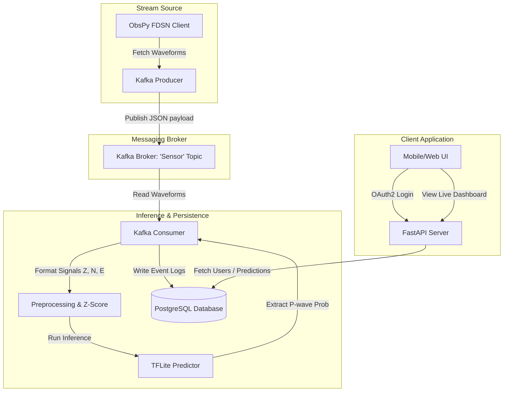

# SeismoSense Backend

SeismoSense is an AI-powered, real-time seismic monitoring and earthquake predictive analytics system. The backend leverages high-throughput stream processing, machine learning inference, and a secure REST API to detect P-wave arrivals from seismic stations globally.

---

## What the Project Can Do

SeismoSense is designed to fetch, stream, process, and analyze live seismic sensor waveforms to predict earthquake indicators.

### 1. Real-Time Waveform Streaming
* **Live FDSN client integration**: Connects to global seismic networks (such as IRIS) using `ObsPy`.
* **Multi-component signal generation**: Continuously fetches Z (vertical), N (North-South), and E (East-West) components from seismic stations (e.g., station `SHL`, network `IN`).
* **Continuous sliding-window publisher**: Packages waveform details (start time, end time, sampling rate, raw samples) into JSON payloads and publishes them to an Apache Kafka broker in real-time windows.

### 2. High-Throughput Event Brokerage
* **Kafka Event Distribution**: Distributes telemetry data via a dedicated `Sensor` topic.
* **Low-Latency Streams**: Standardized queueing ensures sensor logs are processed as soon as they are recorded, allowing for early warning triggers.

### 3. AI-Powered P-Wave Prediction
* **Signal Preprocessing**: The stream consumer standardizes input waves using Z-score standardization and ensures fixed-length inputs (500 samples per channel) using custom zero-padding/clipping.
* **TensorFlow Lite Inference**: Evaluates incoming 3-axis (Z, N, E) waveforms using a custom-trained TFLite earthquake model (`earthquake_model.tflite`) to predict the P-wave probability.

### 4. Robust Data Persistence
* **PostgreSQL Storage**: Connects to a cloud-hosted (Aiven) PostgreSQL instance using `SQLAlchemy` (v2.0+) and the modern `psycopg` (v3) driver.
* **Resilient Connections**: Implements connection pre-pinging (`pool_pre_ping=True`) to automatically reconnect if the cloud server closes idle links.
* **Relational Schema**: Saves prediction data (associated stations, probabilities, timestamps) and user authentication records.

### 5. Secure Identity & Access Management
* **Argon2 Password Hashing**: Protects user credentials using modern Argon2-based cryptographic hashes via `pwdlib`.
* **JWT Bearer Authorization**: Generates signed JSON Web Tokens (JWT) for secure authentication.
* **Protected Routes**: Restricts administrative or profile endpoints using a token dependency filter.

### 6. Developer & Client REST API
FastAPI exposes high-performance web endpoints, complete with interactive Swagger documentation:
* **`GET /health`**: Performs database round-trip checks.
* **`POST /signup`**: User registration with input validators.
* **`POST /login`**: Standard OAuth2-compliant authentication returning JWT tokens.
* **`GET /users/me`**: Returns profiles for authenticated users.
* **`GET /predictions`**: Returns logged P-wave records with pagination.
* **`GET /predictions/station/{station}`**: Retrieves P-wave records filtered by seismic station name.

---

## System Architecture



---

## Getting Started

### Prerequisites
* Python 3.9+
* Apache Kafka Instance (configured with SSL certificates)
* PostgreSQL database (configured inside `.env` or using fallback settings)

### Installation
1. Clone the repository and navigate to the backend directory:
   ```bash
   cd backend
   ```
2. Set up virtual environment and install packages:
   ```bash
   uv sync
   ```

### Execution
* **Launch database test verification**:
  ```bash
  .venv/Scripts/python.exe test_db_conn.py
  ```
* **Start the Web API server**:
  ```bash
  .venv/Scripts/python.exe -m uvicorn main:app --reload
  ```
  Visit the interactive API docs at `http://localhost:8000/docs`.
* **Launch the Kafka Producer**:
  ```bash
  .venv/Scripts/python.exe kafka/producer.py
  ```
* **Launch the AI Kafka Consumer**:
  ```bash
  .venv/Scripts/python.exe kafka/consumer.py
  ```
